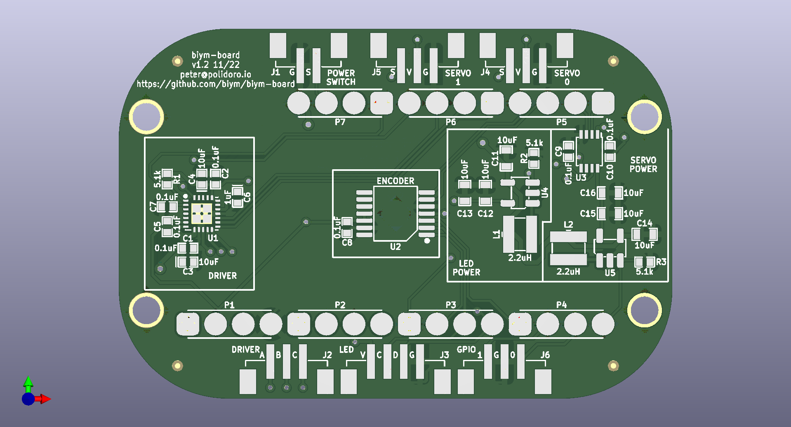

- [About](#org1d32820)
- [Images](#org6a9f21d)
- [Schematic](#orgaac9f41)
- [PCB](#org3dfe019)
- [Bill of Materials](#org53f6dab)
- [Development](#orgc712f8c)

    <!-- This file is generated automatically from .metadata.org -->
    <!-- File edits may be overwritten! -->


<a id="org1d32820"></a>

# About

```markdown
- Project Name: biym-board
- Synopsis: PCB files for biym game.
- Pcb Version: 1.3
- Release Date: 2024-05-16
- Creation Date: 2022-10-28
- License: GPL-3.0
- URL: https://github.com/peterpolidoro/biym-board
- Author: Peter Polidoro
- Email: peter@polidoro.io
- Copyright: 2024 Peter Polidoro
- References:
  - https://www.kicad.org/
  - https://www.adafruit.com/product/4062
  - https://learn.adafruit.com/adafruit-feather/feather-specification
  - https://github.com/adafruit/Adafruit-nRF52-Bluefruit-Feather-PCB
```


<a id="org6a9f21d"></a>

# Images


<a id="orgaac9f41"></a>

# Schematic

[./documentation/schematic/biym-board.pdf](./documentation/schematic/biym-board.pdf)


<a id="org3dfe019"></a>

# PCB




<a id="org53f6dab"></a>

# Bill of Materials

|    |
|--- |
|  |


<a id="orgc712f8c"></a>

# Development

1.  Install Guix.

[Install Guix](https://guix.gnu.org/manual/en/html_node/Binary-Installation.html)

1.  Clone repository.

```sh
git clone https://github.com/peterpolidoro/biym-board
cd biym-board
```

1.  Open project in KiCad

```sh
make project-edits
exit
```

. Open .metadata.org.

```sh
make metadata-edits
```

1.  Modify project specific variables.

```sh
make metadata
```
