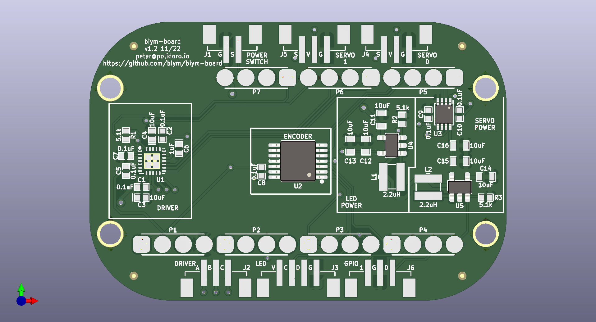
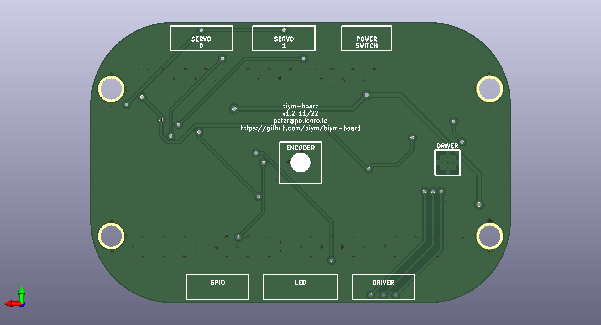
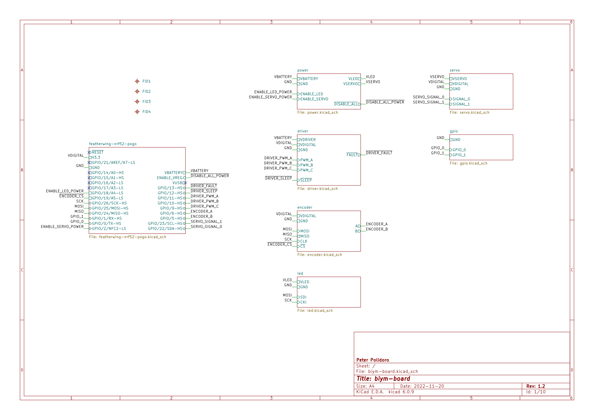
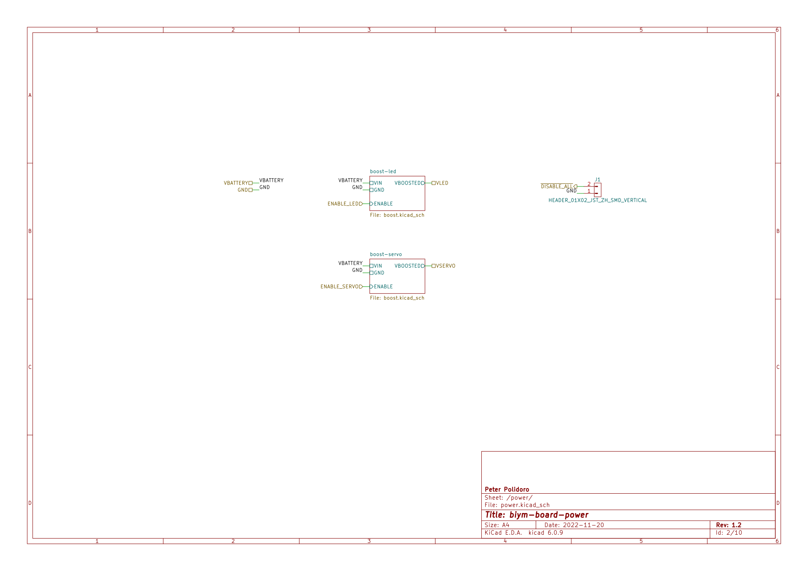
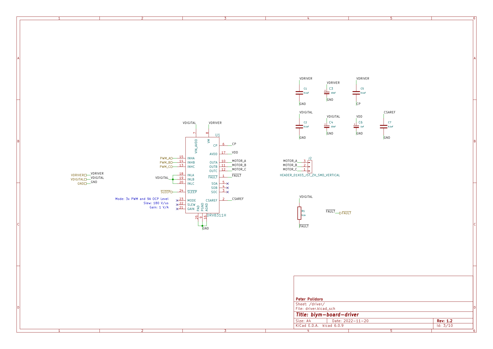
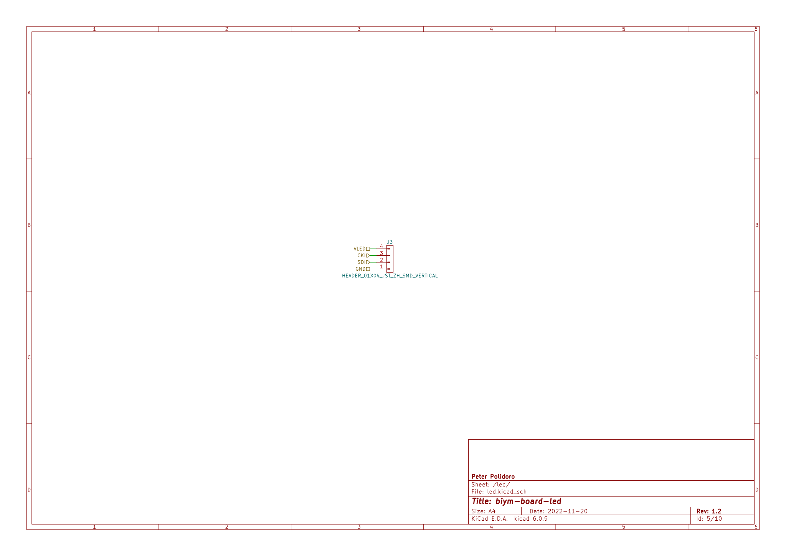
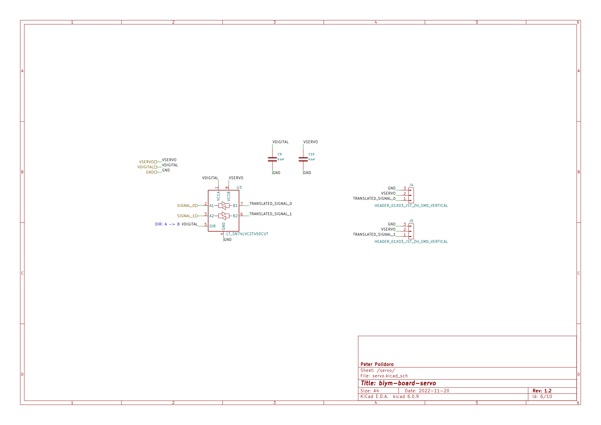
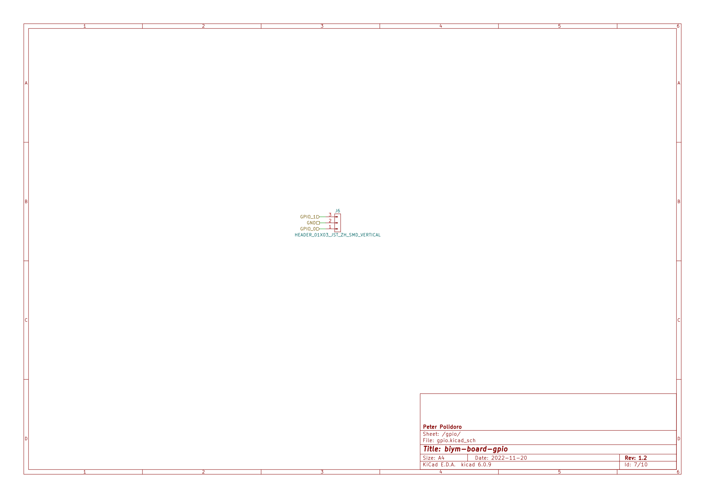
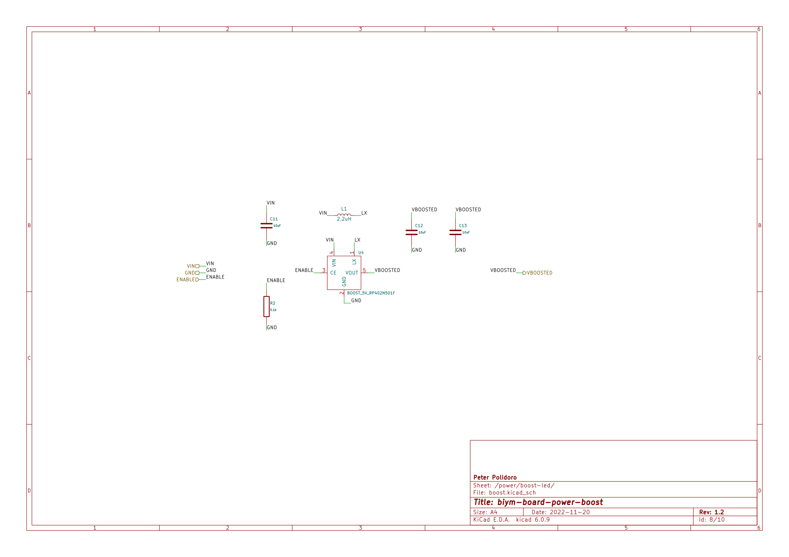
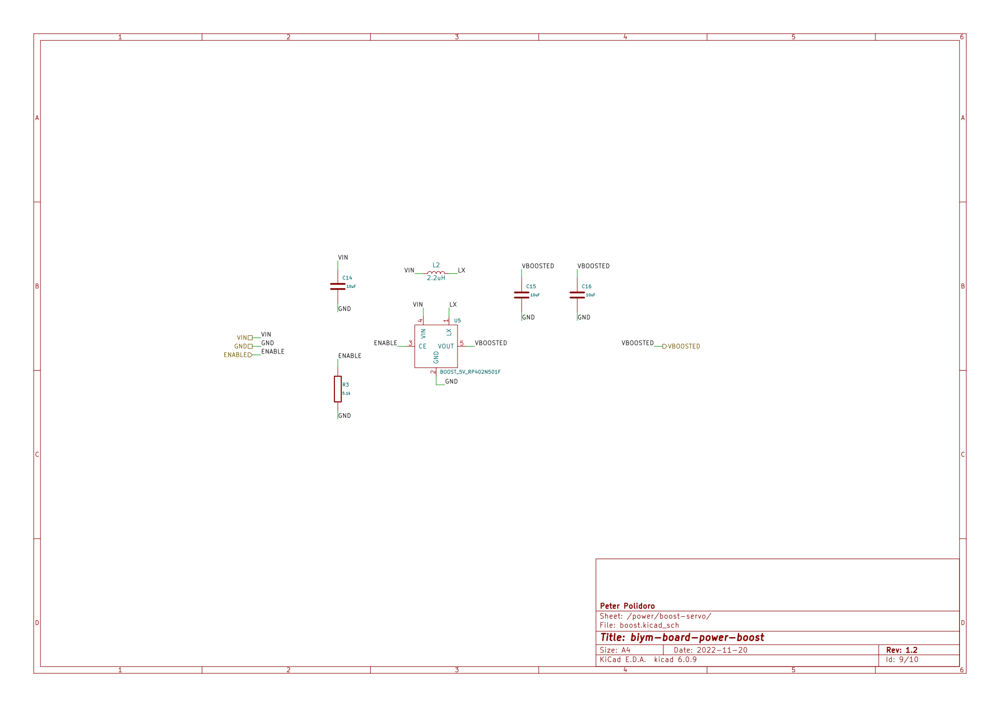

<!---
    This file is generated automatically from .metadata.org
    File edits may be overwritten!
    --->


# About

```markdown
- Name: biym-board
- Description: PCB files for biym game.
- Version: 0.1.0
- Date: 2022-10-28
- License: nil
- URL: https://github.com/biym/biym-board
- Author: Peter Polidoro
- Email: peter@polidoro.io
- Copyright: 2022 Peter Polidoro
- References:
  - https://www.adafruit.com/product/4062
  - https://learn.adafruit.com/adafruit-feather/feather-specification
  - https://github.com/adafruit/Adafruit-nRF52-Bluefruit-Feather-PCB
```


# Images






# Schematic

[./documentation/schematic/biym-board.pdf](./documentation/schematic/biym-board.pdf)



















# PCB


# Bill of Materials

| Item | Reference(s)            | Quantity | Manufacturer                    | Manufacturer Part Number | Vendor   | Vendor Part Number         | Description                                      | Package            |
|---- |----------------------- |-------- |------------------------------- |------------------------ |-------- |-------------------------- |------------------------------------------------ |------------------ |
| 1    | C1 C2 C5 C7 C8 C9 C10   | 7        | Yageo                           | CC0402ZRY5V8BB104        | Digi-Key | 311-1375-1-ND              | CAP CER 0.1UF 25V Y5V                            | 0402               |
| 2    | C3 C4                   | 2        | AVX Corporation                 | TLCK106M006QTA           | Digi-Key | 478-5343-1-ND              | CAP TANT 10UF 20% 6.3V                           | 0402               |
| 3    | C6                      | 1        | Vishay Sprague                  | 298D105X0016K2T          | Digi-Key | 718-1618-1-ND              | CAP TANT 1UF 20% 16V                             | 0402               |
| 4    | C11 C12 C13 C14 C15 C16 | 6        | Murata Electronics              | GRM188R60J106ME47J       | Digi-Key | 490-6405-1-ND              | CAP CER 10UF 6.3V X5R                            | 0603 (1608 Metric) |
| 5    | J1                      | 1        | JST Sales America Inc.          | B2B-ZR-SM4-TF(LF)(SN)    | Digi-Key | B2B-ZR-SM4-TF(LF)(SN)      | CONN HEADER SMD 2POS 1.5MM                       |                    |
| 6    | J2 J4 J5 J6             | 4        | JST Sales America Inc.          | B3B-ZR-SM4-TF(LF)(SN)    | Digi-Key | B3B-ZR-SM4-TF(LF)(SN)      | CONN HEADER SMD 3POS 1.5MM                       |                    |
| 7    | J3                      | 1        | JST Sales America Inc.          | B4B-ZR-SM4-TF(LF)(SN)    | Digi-Key | 455-1683-1-ND              | CONN HEADER SMD 4POS 1.5MM                       |                    |
| 8    | L1 L2                   | 2        | TDK Corporation                 | VLS3012HBX-2R2M          | Digi-Key | 445-175069-1-ND            | FIXED IND 2.2UH 3.15A 106MOHM SM                 |                    |
| 9    | P1 P2 P3 P4 P5 P6 P7    | 7        | Mill-Max Manufacturing Corp.    | 811-22-004-30-001101     | Digi-Key | ED8111-04-ND               | 4 Position Spring Piston Connector Surface Mount |                    |
| 10   | R1 R2 R3                | 3        | Panasonic Electronic Components | ERJ-PA2F5101X            | Digi-Key | P124488CT-ND               | RES SMD 5.1 KOHM 1% 1/5W                         | 0402               |
| 11   | U1                      | 1        | Texas Instruments               | DRV8311HRRWR             | Digi-Key | 296-DRV8311HRRWRCT-ND      | 24V ABS MAX 3 TO 20V 3-PHASE B                   |                    |
| 12   | U2                      | 1        | Osram                           | AS5047P-ATSM             | Digi-Key | AS5047P-ATSMCT-ND          | ROTARY ENCODER MAGNETIC PROG                     |                    |
| 13   | U3                      | 1        | Texas Instruments               | SN74LVC2T45DCUT          | Digi-Key | 296-32331-1-ND             | IC TRNSLTR BIDIRECTIONAL US8                     |                    |
| 14   | U4 U5                   | 2        | Nisshinbo Micro Devices Inc.    | RP402N501F-TR-FE         | Digi-Key | 2129-RP402N501F-TR-FECT-ND | PWM/VFM STEP-UP DCDC CONVERTER W                 | SOT-23-5           |


# Development


## Install Guix

[Install Guix](https://guix.gnu.org/manual/en/html_node/Binary-Installation.html)


## Clone Repository

```sh
git clone https://github.com/biym/biym-board
cd biym-board
```


## Edit .metadata.org

```sh
make metadata-edits
```


## Tangle .metadata.org

```sh
make metadata
```


## Edit files

```sh
make file-edits
exit
```